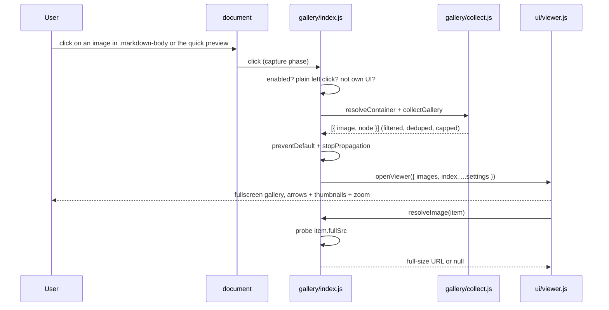
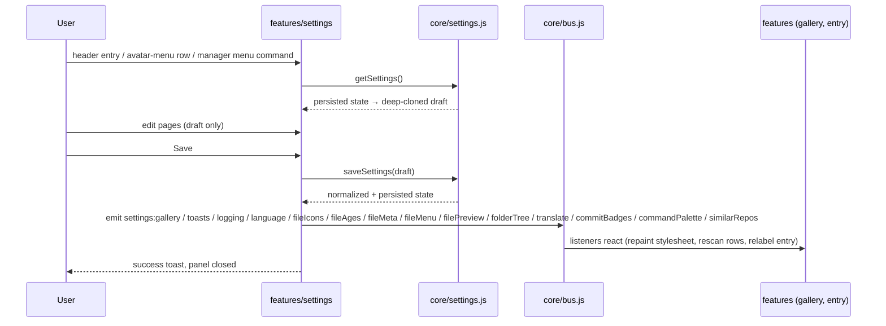

# Architecture

How the pieces fit together and why they are arranged this way. Per-module
detail lives in [`../AGENTS.md`](../AGENTS.md); this document is the map.

## Repository layout

```text
src/
├── main.js                  # Entry: locale init, feature boot, nav overlay reset
├── core/
│   ├── constants.js         # DEFAULT_SETTINGS, storage key, limits
│   ├── settings.js          # load/save + normalization (single source of truth)
│   ├── bus.js               # minimal pub/sub (settings:* events, translate:restored)
│   └── logger/              # GP-#### diagnostics: buffer, console, sanitization
├── i18n/
│   ├── meta.js              # SUPPORTED_LOCALES, aliases, native names
│   ├── index.js             # configureLocale(), t()
│   └── locales/             # one file per locale, registry in locales/index.js
├── gallery/
│   ├── sources.js           # source registry (registerSource / listSources)
│   ├── collect.js           # normalize, filter, de-duplicate, cap
│   ├── index.js             # delegated click + hover, cursor stylesheet, download button
│   └── sources/markdown.js  # the markdown source (side-effect registration)
├── features/
│   ├── logging/             # applies logging.enabled to core/logger
│   ├── settings/
│   │   ├── index.js         # settings entry: user-menu row, pages, menu command
│   │   ├── userMenu.js      # settings row inside GitHub's user (avatar) menu
│   │   ├── panel.js         # panel shell: grouped nav, search, pages, draft
│   │   ├── controls.js      # section / row / field / switch / select / input / button
│   │   ├── confirm.js       # promise-based confirm dialog
│   │   └── tabs/            # general, gallery, files, commits, translate, commandPalette, discovery, backup, about
│   ├── fileIcons/           # colored file/folder glyphs (registry + generated icon set)
│   ├── fileAges/            # blame-style last-commit date tints
│   ├── fileMeta/            # size column and download buttons
│   ├── fileMenu/            # file/folder context menu
│   ├── filePreview/         # quick preview: surfaces, renderers, long press
│   ├── folderTree/          # expandable folder rows in the listing
│   ├── commitBadges/        # Conventional Commit type/scope token
│   ├── translate/           # on-page translation: surfaces, providers, cache
│   ├── commandPalette/      # palette: context, rank, sources, GitHub client, store
│   └── similarRepos/        # similar-repositories sidebar: providers, scoring, panel
├── styles/
│   ├── tokens.css           # :root design tokens (--gp-* palette)
│   └── app.css              # injected stylesheet (gp- prefix)
├── ui/
│   ├── icons.js             # 16×16 glyphs (viewer toolbar, menu actions)
│   ├── headerActions.js     # registry for GitHub header entries
│   ├── toast.js             # notifications (positions, dedup, actions)
│   ├── contextMenu.js       # reusable fixed-position menu
│   ├── filePreview.js       # quick-preview modal shell (header, footer, keys)
│   ├── commandPalette.js    # palette shell: scope path, combobox, grouped listbox
│   └── viewer.js            # fullscreen image viewer (reusable lightbox)
└── utils/
    ├── dom.js               # el, append, debounce, eachNode, toArray, escapeHtml, isOwnUi
    ├── download.js          # fetch → blob → <a download>, new-tab fallback
    ├── fileTarget.js        # rawUrlFor / fileTarget / resolveFileTarget — pure
    ├── http.js              # GM_xmlhttpRequest / fetch transport
    ├── navigation.js        # watchNavigation (turbo/pjax/history URL watcher)
    ├── scrollLock.js        # counted page scroll lock for modal overlays
    ├── shortcut.js          # shortcut parsing, matching and display — pure
    └── size.js              # formatSize — pure size formatting
```

## Module graph


```mermaid
graph TD
  main --> core
  main --> settingsFeature[features/settings]
  main --> fileIcons[features/fileIcons]
  main --> fileAges[features/fileAges]
  main --> fileMeta[features/fileMeta]
  main --> fileMenu[features/fileMenu]
  main --> filePreview[features/filePreview]
  main --> folderTree[features/folderTree]
  main --> commitBadges[features/commitBadges]
  main --> translate[features/translate]
  main --> commandPalette[features/commandPalette]
  main --> similarRepos[features/similarRepos]
  main --> gallery
  main --> ui
  main --> utils
  gallery --> core
  gallery --> ui
  gallery --> utils
  gallery --> i18n
  settingsFeature --> core
  settingsFeature --> ui
  settingsFeature --> utils
  settingsFeature --> i18n
  settingsFeature --> galleryRegistry[gallery/sources]
  settingsFeature --> commitParse[features/commitBadges/parse]
  settingsFeature --> paletteStore[features/commandPalette/store]
  fileIcons --> core
  fileIcons --> utils
  fileAges --> core
  fileAges --> utils
  fileMeta --> core
  fileMeta --> ui
  fileMeta --> utils
  fileMeta --> i18n
  fileMenu --> core
  fileMenu --> ui
  fileMenu --> utils
  fileMenu --> i18n
  fileMenu --> filePreview
  fileMenu --> folderTree
  filePreview --> core
  filePreview --> ui
  filePreview --> utils
  filePreview --> i18n
  filePreview --> previewAction[features/translate/previewAction]
  folderTree --> core
  folderTree --> ui
  folderTree --> utils
  folderTree --> i18n
  commitBadges --> core
  commitBadges --> utils
  commitBadges --> i18n
  translate --> core
  translate --> ui
  translate --> utils
  translate --> i18n
  commandPalette --> core
  commandPalette --> ui
  commandPalette --> utils
  commandPalette --> i18n
  commandPalette --> settingsPanel[features/settings/panel]
  commandPalette --> translateCache[features/translate/cache]
  similarRepos --> core
  similarRepos --> ui
  similarRepos --> utils
  similarRepos --> i18n
  ui --> core
  ui --> utils
  ui --> i18n
  core --> i18n
  core --> utils
```

Import direction: `utils ← core ← gallery ← features`. `main.js` may import
from anywhere but owns no feature state; `core/settings.js` knows nothing about
features or the bus; `ui/*` stay reusable primitives that only depend on
`i18n`, `utils` and `core` helpers.

## Feature lifecycle

There is **no scan loop and no document-wide MutationObserver**. Everything
that has to survive GitHub's re-renders is either (a) CSS, (b) a delegated
listener that walks the live DOM at event time, (c) a re-mount triggered by an
explicit navigation event, or (d) one observer on a container GitHub itself
owns — `features/settings/userMenu.js` watches Primer's overlay portal root
(`#__primerPortalRoot__`), which holds nothing but overlays and stays empty
otherwise. `features/fileIcons/`, `features/fileAges/`, `features/fileMeta/`,
`features/filePreview/`, `features/folderTree/` and `features/commitBadges/`
follow the same rule at a smaller scale: one observer per known
file-list or commit container (repository tree, PR header list, last-commit
cells, commit lists, and so on),
never one on the document, and a surface whose selector stops
matching turns into a no-op instead of breaking the pagination. File meta adds
two bounded mechanisms of its own: a shared IntersectionObserver that defers a
row's HEAD size probe until it is near the viewport, and a small request queue
that caps concurrent probes. Folder tree and commit badges add the same
`<html>`/`<body>` direct-children watchers as the file features, because a
replaced body leaves the container observers dead; folder tree re-inserts the
rows it owns from its session cache when React drops them, and never treats a
toast or the hold ring (direct `<body>` children) as a shell swap. Translation
watches one root per enabled surface and prunes a container that leaves the
DOM; the command palette observes nothing on the page, only its own hotkey;
similar repositories resolves one sidebar and observes that container, then
backs off — it never scans the document for a sidebar that may appear later.


```mermaid
sequenceDiagram
  participant U as User
  participant D as document
  participant G as gallery/index.js
  participant C as gallery/collect.js
  participant V as ui/viewer.js

  U->>D: click on an image in .markdown-body or the quick preview
  D->>G: click (capture phase)
  G->>G: enabled? plain left click? not own UI?
  G->>C: resolveContainer + collectGallery
  C-->>G: [{ image, node }] (filtered, deduped, capped)
  G->>G: preventDefault + stopPropagation
  G->>V: openViewer({ images, index, ...settings })
  V-->>U: fullscreen gallery, arrows + thumbnails + zoom
  V->>G: resolveImage(item)
  G->>G: probe item.fullSrc
  G-->>V: full-size URL or null
```

Why capture phase: GitHub attaches its own delegated click handlers. Resolving
the gallery first and stopping propagation means a gallery image can never both
open the viewer and trigger GitHub's link handling, while modified and middle
clicks stay with the browser.

Why the affordance is generated CSS: the zoom-in cursor is the only thing that
must be applied to page markup — images keep GitHub's own look, with no border
or overlay added — so it lives in one stylesheet built from the registry
(`#gp-gallery-style`). A React re-render cannot strip a stylesheet, and images
rendered long after load are decorated for free. When no source is enabled the
stylesheet is removed entirely, leaving the page stock.

The hover download button follows the same rule: one delegated
`pointerover`/`pointerout` pair resolves the hovered image through the same
`collectGallery`/`matchIndex` path and positions a single
`.gp-download-btn` element appended to `<body>`. Nothing is inserted into
GitHub's markup, there is no per-image state, and the element is dropped on
navigation. Its click is excluded through `isOwnUi()`, so it never opens the
viewer.

The file context menu is the other delegated listener: one capture-phase
`contextmenu` handler resolves the clicked node to a file (a listing row link
or the blob page's own content) at event time, and only then suppresses the
native menu. Folders, media and foreign links fall through to the browser, so
the feature cannot break a right-click it does not own. The menu element itself
lives in `ui/contextMenu.js`, is appended to `<body>`, and is removed on close,
outside press, scroll, resize and navigation.

The quick preview is the one feature that both injects a row button and opens
an overlay. Its observers decorate listing rows with an eye button (the same
per-container pattern as the other file features), and the click opens
`ui/filePreview.js` with a `load` callback supplied by
`features/filePreview/render.js`, so the shell stays a reusable modal and the
feature owns fetching and rendering. A second, delegated capture-phase
`pointerdown` listener implements the optional long press on a file name; it
starts a timer, cancels on movement or release, and swallows the click that
would otherwise navigate. The files of the current directory are the modal's
set; the footer and the arrow keys move through them.

## Settings lifecycle


```mermaid
sequenceDiagram
  participant U as User
  participant P as features/settings
  participant S as core/settings.js
  participant B as core/bus.js
  participant F as features (gallery, entry)

  U->>P: header entry / avatar-menu row / manager menu command
  P->>S: getSettings()
  S-->>P: persisted state → deep-cloned draft
  U->>P: edit pages (draft only)
  U->>P: Save
  P->>S: saveSettings(draft)
  S-->>P: normalized + persisted state
  P->>B: emit settings:gallery / toasts / logging / language / fileIcons / fileAges / fileMeta / fileMenu / filePreview / folderTree / translate / commitBadges / commandPalette / similarRepos
  B->>F: listeners react (repaint stylesheet, rescan rows, relabel entry)
  P-->>U: success toast, panel closed
```

`saveSettings()` never notifies; the caller emits. That split keeps persistence
in `core` and reactions in the UI/features, and it is what makes a backup import
(`applyExternalSettings`) behave exactly like a footer Save.

## Navigation and overlays

GitHub navigates without a reload (Turbo, plus classic `pushState`), and it
replaces `<body>` while module state lives on. `main.js` subscribes to
`watchNavigation()` and closes the viewer, the panel and the quick preview on
every URL change;
otherwise a "closed" viewer would keep reporting itself open (and swallow
`Escape` for the panel) and a pinned page would stay pinned. The settings entry
subscribes to the same watcher to re-mount its header button; the avatar-menu
row needs no reset, because GitHub unmounts that menu on navigation itself. The
file menu closes through its own `watchNavigation` hook, since its position is
page coordinates that no longer mean anything after the page changes.

## Extension points

| Goal | Touch |
|------|-------|
| A new place with images (diff view, project board, …) | Register a source in `src/gallery/sources/`, import it from `src/gallery/index.js`, add its default switch in `core/constants.js`, add its two locale keys in all ten locales. The settings panel picks it up from the registry. |
| A new settings page | `registerPage({ id, icon, labelKey, descKey, render })` and a module in `features/settings/tabs/`. The page reads and mutates `getDraft()`. |
| A new place GitHub lists files | Add a surface to `src/features/fileIcons/surfaces.js` (`containers`, `rows`, `resolve(row)`); if the rows also show a last-commit date, add it to `src/features/fileAges/surfaces.js`; if they link to a file view and do not already show a size or a download button, add it to `src/features/fileMeta/surfaces.js` (`resolve` returns the raw address; the surface's `header` and `columnLabelKey` place the column's label); if a right-click on a row should open the file menu, add the row to `src/features/fileMenu/surfaces.js`; if the row should offer the eye button, add it to `src/features/filePreview/surfaces.js` (`PREVIEW_SURFACE`). Observers and injection are shared per feature. |
| A new file action | Add an entry to `buildItems()` in `src/features/fileMenu/index.js` (label key, `ACTION_ICONS` glyph, handler), its key in all ten locales, and a toast for the outcome. The menu component itself needs no change. |
| A context menu elsewhere | `openContextMenu({ x, y, label, items })` from `ui/contextMenu.js` — it is a standalone component; give it an anchor and `keyboard: true` for keyboard-triggered opens. |
| A new setting | Add it to `DEFAULT_SETTINGS` + a normalizer in `core/settings.js`, expose a getter, add the control to a tab, and document the key in `README.md` / `AGENTS.md`. Emit the matching bus event on Save if a feature must react. |
| A new similar-repositories provider | Add a `fetch*` module beside `features/similarRepos/github.js` and `simrepo.js` that returns `{ items, hasMore }` and throws `ApiError` for every failure; register its id in `SIMILAR_REPOS_PROVIDERS` (`core/constants.js`), dispatch it in `api.js`, and add the option plus its hint to `tabs/discovery.js` in all ten locales. The panel, cache and paging need no change. |
| A lightbox somewhere else | `openViewer({ images })` from `ui/viewer.js` — it is a standalone component with localizable, per-call overridable labels. |

## Invariants

- Every injected class is `gp-`-prefixed; no rule targets page markup except the
  gallery affordance stylesheet, which exists only while the gallery is on.
- Nothing is persisted from a panel page render; only the footer Save (or an
  import) writes settings.
- Any value read from storage or a backup goes through normalization — unknown
  values fall back to defaults, never crash the page.
- Injected UI never touches GitHub's own header/markup nodes; it only inserts
  siblings next to them. File icons additionally hide GitHub's glyph with an
  inline style and restore it on teardown, file ages add their `.gp-age-date`
  classes to GitHub's own timestamp, file meta appends its own `td` to a
  row and its own `th` to the table header, and the file menu only replaces a
  native menu; none writes a page-markup CSS rule.
- DOM collections are iterated with `eachNode`/`toArray`, never `for...of`.
